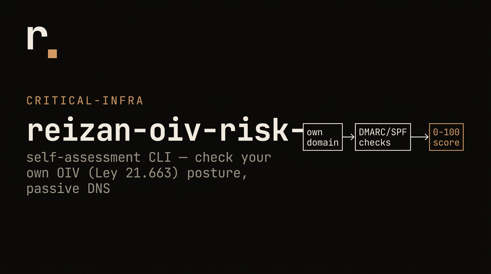

<p align="center">
  
</p>

# reizan-oiv-risk-check

Self-assessment CLI for Chilean entities checking their own domain posture under Ley 21.663. It combines `anci-oiv-resolver` OIV designation context with passive DNS checks for email authentication, DNS integrity, and basic HTTPS reachability.

## Ethical Scope

This tool is for self-run assessment only.

- Use it only on domains controlled by the running entity.
- Domain posture assessment requires `--self-attest` or `--i-own-this-domain`.
- It uses public DNS lookups plus minimal HTTPS fetches for HTTPS and MTA-STS policy reachability.
- It never performs active port scanning, service enumeration, exploit checks, credential checks, or third-party scanning.

The CLI is informational and not legal advice.

## Install

```bash
npm install -g reizan-oiv-risk-check
```

Or run from a project:

```bash
npm install reizan-oiv-risk-check
npx reizan-oiv-risk-check --help
```

## Usage

```bash
# OIV designation lookup only. No domain assessment is run.
reizan-oiv-risk-check --rut 97006000-6

# Assess your own domain.
reizan-oiv-risk-check --domain example.cl --self-attest

# Combine OIV context and domain posture.
reizan-oiv-risk-check --rut 97006000-6 --domain example.cl --self-attest

# JSON mode for internal evidence pipelines.
reizan-oiv-risk-check --rut 97006000-6 --domain example.cl --self-attest --json
```

If `--rut` is provided without `--domain`, the CLI reports OIV designation. If `--self-attest` is also provided and the RUT is present in `anci-oiv-resolver`, the CLI assesses the resolver canonical domain.

`anci-oiv-resolver@0.6.0` publishes sector and domain status, but it does not publish a `FASE` field. This package reports FASE as `null` / "not published by resolver" rather than inferring a regulatory phase.

## Checks

The self-assessment uses:

- SPF TXT at the apex domain.
- DKIM presence using a small passive selector set: `default`, `selector1`, `selector2`, `google`, `k1`, `s1`, `s2`, `dkim`.
- DMARC TXT at `_dmarc.<domain>` and policy classification: `none`, `quarantine`, `reject`.
- MTA-STS TXT at `_mta-sts.<domain>` and policy fetch from `https://mta-sts.<domain>/.well-known/mta-sts.txt`.
- MX records and basic MX redundancy.
- DNSSEC evidence through DS/DNSKEY DNS lookups.
- HTTPS/TLS reachability through one HTTPS HEAD request to the apex domain.

DKIM selector discovery is not universal. A "not found" result means no DKIM key was found in the checked passive selector set; it does not prove that no private selector exists.

## Maturity Model

The score is 0-100.

| Control | Points | Scoring summary |
|---|---:|---|
| SPF | 15 | Full points for SPF with `-all`; partial for `~all` or weaker records. |
| DMARC | 20 | `p=reject` full, `p=quarantine` partial, `p=none` monitoring-only. |
| DKIM | 10 | Full when a DKIM selector is found in the passive selector set. |
| MX | 10 | Full for at least two distinct MX exchanges; partial for one. |
| MTA-STS | 10 | Full for TXT plus reachable `mode: enforce` policy. |
| HTTPS/TLS | 15 | Full for HTTPS reachability plus HSTS; partial for HTTPS only. |
| DNSSEC | 20 | Full when DS-backed DNSSEC evidence is observed. |

Bands:

- `Initial`: 0-39
- `Basic`: 40-59
- `Managed`: 60-79
- `Mature`: 80-100

Remediation items are tied to Ley 21.663 deber-de-seguridad as practical evidence of baseline risk reduction, continuity, and control operation.

## Open-Core Note

The free package includes the CLI, JSON report, library API, and documented scoring model. A signed attestation report suitable for formal compliance evidence is the paid tier. The paid attestation workflow is intentionally not implemented in this open package.

## Library API

```ts
import { buildRiskCheckReport } from 'reizan-oiv-risk-check';

const report = await buildRiskCheckReport({
  domain: 'example.cl',
  rut: '97006000-6',
  selfAttested: true
});

console.log(report.assessment?.score.total);
```

## Development

```bash
npm install
npm run lint
npm run typecheck
npm test
npm run build
```

The normal test suite uses mocked DNS and HTTP. It does not scan live third-party domains.

---

# reizan-oiv-risk-check (ES)

CLI de autoevaluación para entidades chilenas que revisan su propio dominio bajo la Ley 21.663. Combina el contexto de designación OIV de `anci-oiv-resolver` con verificaciones pasivas de DNS, autenticación de correo, DNSSEC y alcanzabilidad HTTPS básica.

## Alcance Ético

Esta herramienta es solo para autoevaluación.

- Úsala únicamente sobre dominios controlados por la entidad que ejecuta el comando.
- La evaluación de postura de dominio exige `--self-attest` o `--i-own-this-domain`.
- Usa consultas DNS públicas y fetches HTTPS mínimos para HTTPS y política MTA-STS.
- Nunca realiza escaneo de puertos, enumeración de servicios, pruebas de explotación, credenciales ni escaneo de terceros.

El resultado es informativo y no constituye asesoría legal.

## Uso

```bash
# Solo consulta de designación OIV. No evalúa el dominio.
reizan-oiv-risk-check --rut 97006000-6

# Evaluar un dominio propio.
reizan-oiv-risk-check --domain example.cl --self-attest

# Combinar contexto OIV y postura de dominio.
reizan-oiv-risk-check --rut 97006000-6 --domain example.cl --self-attest

# JSON para pipelines internos de evidencia.
reizan-oiv-risk-check --rut 97006000-6 --domain example.cl --self-attest --json
```

Si se entrega `--rut` sin `--domain`, la CLI informa la designación OIV. Si además se entrega `--self-attest` y el RUT existe en `anci-oiv-resolver`, la CLI evalúa el dominio canónico del resolver.

`anci-oiv-resolver@0.6.0` publica sector y estado de dominio, pero no publica un campo `FASE`. Este paquete reporta FASE como `null` / "not published by resolver" y no inventa una fase regulatoria.

## Controles Evaluados

- SPF en TXT del dominio raíz.
- Presencia DKIM con selectores pasivos acotados.
- DMARC en `_dmarc.<domain>` y política `none`, `quarantine` o `reject`.
- MTA-STS en `_mta-sts.<domain>` y política HTTPS.
- MX y redundancia básica.
- DNSSEC mediante DS/DNSKEY.
- Alcanzabilidad HTTPS/TLS con un HEAD al dominio raíz.

## Modelo de Madurez

Puntaje total: 0-100.

| Control | Puntos |
|---|---:|
| SPF | 15 |
| DMARC | 20 |
| DKIM | 10 |
| MX | 10 |
| MTA-STS | 10 |
| HTTPS/TLS | 15 |
| DNSSEC | 20 |

Bandas: `Initial` 0-39, `Basic` 40-59, `Managed` 60-79, `Mature` 80-100.

Las remediaciones se conectan con el deber de seguridad de la Ley 21.663 como medidas concretas de reducción de riesgo, continuidad y evidencia auditada.

## Nota Open-Core

El paquete gratuito incluye CLI, salida JSON, API de librería y modelo de scoring documentado. El reporte de atestación firmado para evidencia formal es el tier pagado. Ese flujo pagado no se implementa en este paquete abierto.

## Licencia

MIT.
